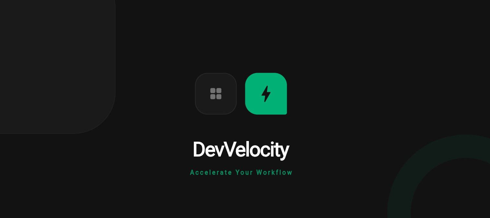

# DevVelocity Mobile Platform

[](https://flutter.dev)
[](https://dart.dev)
[](#-architectural-blueprint)
[](https://dart.dev/guides/language/effective-dart)

An enterprise-grade, high-performance developer workspace and community pipeline tracker built with Flutter. This platform transitions away from generic, flat layouts into a highly structural, dark **Neo-Minimalist Bento Grid UI** architecture, engineered using production-ready defensive programming patterns.

---
## 📱 Interface Preview

|---|
|   | 

---

## 🎨 Design System & UI Architecture

The interface is engineered around contemporary dashboard modularity principles (Bento Grid Layout), optimized heavily for high visual scannability and structural hierarchy.

### 1. Tokenized Color Matrix
Instead of hardcoded values, the application enforces rigid design tokenization via a centralized theme engine:
* **Canvas Background (`0xFF121212`):** Ultra-dark charcoal surface to minimize eye strain during long telemetry monitoring sessions.
* **Surface Container (`0xFF1A1A1A`):** Low-contrast block backgrounds that isolate layout modules cleanly.
* **Vibrant Emerald Accent (`0xFF00B27A`):** High-frequency visual trigger utilized exclusively for call-to-actions, primary state vectors, and active pipeline statuses.

### 2. Asymmetric Structural Geometry
To mirror physical modular grid spaces, cards utilize a signature asymmetric corner calculation (`borderRadius: 36` on three vertices, anchored down by a crisp `Radius.circular(8)` accent corner). This thematic constraint is preserved uniformly across both onboarding and core workspace views.

---

## 🏗️ Architectural Blueprint

The codebase strictly rejects flat-file anti-patterns, opting for a highly scalable, decoupled **Feature-First Layered Architecture**. This ensures the app remains maintainable as team sizes and features scale.

```text
lib/
├── core/
│   ├── constants/          # Application-wide static assets, keys, and paths
│   └── theme/              # Encapsulated typography matrices and tokenized palettes
├── features/
│   ├── onboarding/         # Onboarding domain
│   │   ├── presentation/   # High-fidelity view components (Splash & Login UI)
│   │   └── widgets/        # Asymmetric geometric layout tiles & animated components
│   └── dashboard/          # Core metrics domain
│       └── presentation/   # Primary navigation shells and active workspace modules
└── main.dart               # Unified application bootstrapping layer

```

### Engineered Code Patterns Demonstrated:

* **Defensive UI Constraining:** Implements fluid bounds wrappers (`Flexible`, `Expanded`, and max-line text truncation with `TextOverflow.ellipsis`) to completely eliminate runtime layout/text overflow banners across varying physical device aspect ratios.
* **Implicit Micro-Animations:** Leverages hardware-accelerated implicit animations (`AnimatedPositioned`, `AnimatedScale`) bound to mathematical physics curves (`Curves.easeOutBack`, `Curves.elasticOut`) to deliver premium execution responses without draining local memory cycles.

---

## 🚀 Local Deployment Lifecycle

Follow these steps to spin up the local compiler ecosystem in your environment:

### 1. Environment Verification

Ensure your local Flutter SDK environment satisfies the minimum constraints:

```bash
flutter doctor

```

### 2. Dependency Resolution

Clone the target cluster and fetch the required pub-packages:

```bash
git clone [https://github.com/deboraht07/devVelocity.git](https://github.com/deboraht07/devVelocity.git)
cd devVelocity
flutter clean && flutter pub get

```

### 3. Compilation Target Execution

Compile the production-debug asset wrapper directly onto your active physical device or emulator instance:

```bash
flutter run

```

---

## 📝 Engineering Log & Code Style

Development follows the **Conventional Commits 1.0.0** specification for granular, searchable repository version history:

* `feat(onboarding): implement dynamic geometric bento layout for splash screen`
* `fix(auth): correct runtime transparency calculation on secure sign-in boundaries`
* `docs(readme): formalize architectural roadmap and UI tokens specification`

```

---

### Terminal Wrap-Up Commands 🚀

Once saved, copy and run these final lines in your terminal to sync everything to GitHub:

```powershell
git add README.md
git commit -m "docs(readme): replace with production-grade enterprise documentation"
git push


